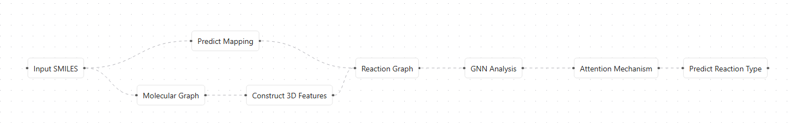
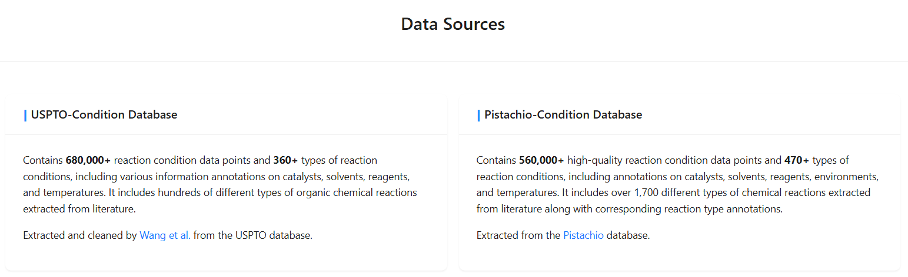
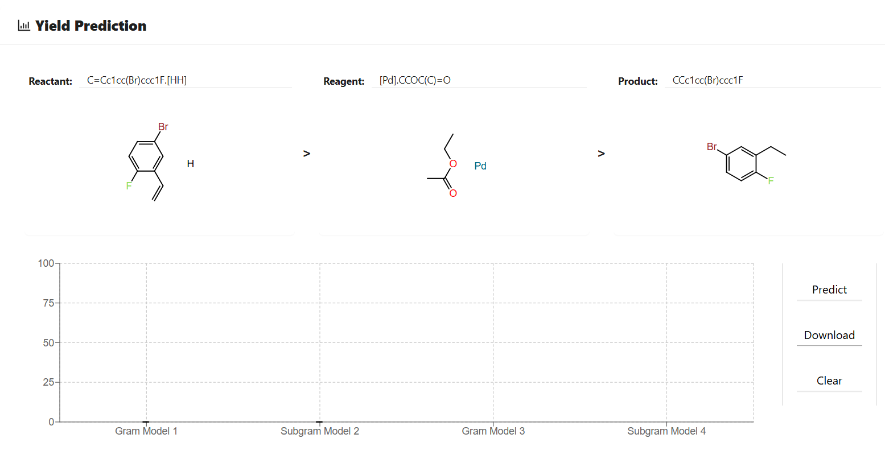
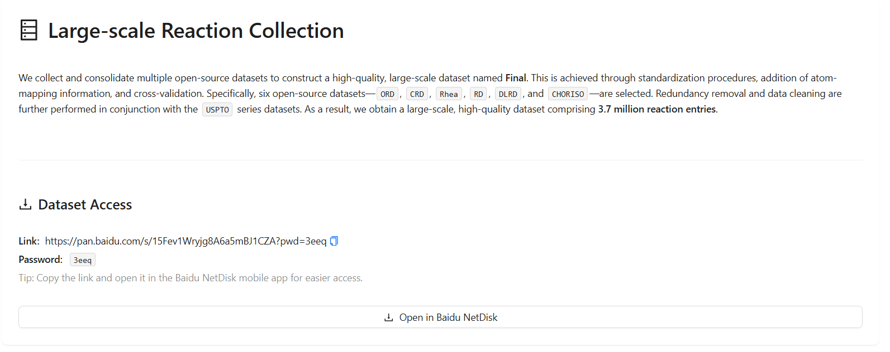

# 分子工厂平台：基于模型协同的化学反应智能分析系统

## 平台概述

分子工厂（Molecule Factory）是一个基于人工智能的化学反应分析平台，通过多个深度学习模型的协同工作，为化学研究提供从反应理解到条件优化的完整解决方案。平台的核心创新在于Reaction Graph技术，该技术将化学反应的3D分子结构信息整合到图神经网络框架中，实现了反应分类、条件预测、产率预测和反应数据库查询等功能的有机协同。

平台基于大规模化学反应数据训练，包括USPTO和Pistachio等权威数据库，涵盖超过370万个反应条目。通过统一的分子表示学习和多任务协同优化，平台能够为药物发现、材料科学、化学教育等多个领域提供数据驱动的决策支持。

## 核心功能模块

### 反应分类工具

反应分类是分子工厂平台的基础分析模块，负责识别和分类化学反应的类型。该工具基于Pistachio数据库训练，利用Reaction Graph技术和注意力机制实现高精度反应分类。系统能够识别包括杂原子烷基化和芳基化、酰化和相关过程、C-C键形成、杂环形成、保护基反应、脱保护反应、还原反应、氧化反应、官能团互变、官能团加成等十种主要反应类型。

该工具的核心价值在于为后续分析提供反应机理信息。通过准确识别反应类型，系统能够理解反应的本质特征和变化规律，为条件预测和产率预测提供重要的先验知识。同时，反应分类结果还可用于数据标注、模型预训练和化学教育等场景。

### 反应条件预测工具

反应条件预测工具是平台的核心功能之一，能够基于反应类型和分子特征预测最优的反应条件。该工具基于USPTO和Pistachio数据库训练，采用自回归方式输出五类反应条件：催化剂、溶剂、试剂、温度、压力和气氛。系统能够提供15种不同的条件组合预测，为实验设计提供全面的参考。

该工具的数据来源包括USPTO-Condition数据库（68万+反应条件数据点，360+种反应条件类型）和Pistachio-Condition数据库（56万+高质量反应条件数据点，470+种反应条件类型）。通过深度学习模型学习反应条件与反应类型、分子结构之间的复杂关系，系统能够为不同类型的反应推荐最适合的条件组合。

### 产率预测工具

产率预测工具是平台的重要功能模块，能够预测化学反应的产率并量化预测不确定性。该工具基于大规模USPTO数据集训练，支持克级和毫克级反应的不同建模策略。系统采用多模型集成的方法，提供四个不同规模的预测模型，通过集成学习提高预测准确性和可靠性。

该工具不仅提供产率预测，还支持用户自定义数据训练。研究人员可以上传自己的产率数据，训练针对特定反应类型的定制化模型。这种个性化训练能力使得平台能够适应不同研究领域和应用场景的特殊需求。

### 反应数据库工具

反应数据库工具是平台的开放共享功能，提供大规模高质量的反应数据查询和下载服务。该工具整合了多个开源数据集，包括ORD、CRD、Rhea、RD、DLRD、CHORISO等六个权威数据库，通过标准化处理、原子映射信息添加和交叉验证，构建了包含370万个反应条目的高质量数据集。

该工具的价值在于促进化学研究社区的知识共享和协作创新。研究人员可以基于平台的数据进行进一步的研究开发，推动整个化学AI领域的发展。同时，开放的数据访问也促进了新算法和新模型的开发，形成了良性的研究生态。

## 模型协同工作架构

分子工厂平台的核心优势在于其模型协同工作架构。整个系统以Reaction Graph为统一基础，构建了一个多模块协同的分析工作流。当用户输入化学反应的SMILES表示时，系统首先通过Reaction Graph技术构建包含3D结构信息的分子图表示，然后进行原子映射预测和反应中心识别。

基于这一统一表示，系统并行运行四个核心分析模块：反应分类模块识别反应类型，为后续分析提供反应机理信息；条件预测模块基于反应类型和分子特征，输出最优反应条件；产率预测模块结合反应类型和条件信息，预测反应产率并量化不确定性；反应数据库模块提供相关反应案例和参考信息。各模块的结果通过综合分析引擎整合，生成包含反应机理、最优条件、预期产率和相关案例的完整分析报告。

这种协同架构的关键在于模块间的信息传递和知识共享。反应分类的结果指导条件预测的策略选择，不同反应类型对应不同的条件优化模式；条件预测的结果影响产率预测的准确性，因为反应条件直接影响产率；产率预测的置信度评估为整体分析提供可靠性指标；反应数据库提供的历史案例为预测结果提供验证和参考。通过这种端到端的协同优化，平台能够提供比单一功能模块更准确、更全面的化学反应分析。

## 技术特色

### Reaction Graph技术创新

Reaction Graph技术是平台的核心技术特色，代表了化学反应表示学习的重要突破。该技术通过将3D分子结构信息整合到图神经网络中，有效捕获了分子间的空间相互作用和反应过程中的原子变化。与传统的2D分子图表示相比，Reaction Graph能够更准确地描述反应过程中的立体化学变化和空间约束。

该技术的创新点在于统一了反应物和产物的分子图表示，通过原子映射信息建立了反应前后的原子对应关系。这种表示方法不仅保留了分子的结构信息，还编码了反应过程中的化学变化规律。通过注意力机制，系统能够突出反应中心，识别参与反应的关键原子和化学键，为下游任务提供高质量的特征表示。

### 多任务协同学习

平台采用多任务协同学习策略，实现了不同功能模块间的知识共享和相互促进。通过共享Reaction Graph的底层特征表示，各模块能够学习到通用的化学知识，提高整体性能。同时，不同任务间的相关性被充分利用，反应分类的知识指导条件预测，条件预测的结果影响产率预测，形成了良性的协同学习循环。

这种协同学习不仅提高了各模块的预测准确性，还增强了系统的泛化能力。通过多任务训练，模型能够学习到更丰富的化学表示，更好地理解反应机理和条件-产率关系。此外，协同学习还减少了数据需求，提高了训练效率，使得平台能够在相对较小的数据集上取得优异的性能。

### 可扩展架构设计

平台采用模块化的可扩展架构设计，支持新功能的快速集成和现有功能的持续优化。每个功能模块都是相对独立的，可以单独训练和更新，而不影响其他模块的正常工作。这种设计使得平台能够灵活适应不同用户的需求，支持定制化开发。

同时，平台还支持用户自定义模型的训练和部署。研究人员可以基于自己的数据训练专门的模型，并将其集成到平台中。这种开放性和可扩展性使得平台能够持续发展和完善，适应化学研究领域的新需求和新挑战。

## 应用价值

平台的应用价值体现在多个方面。在药物发现领域，研究人员可以利用平台设计合成路线、优化反应条件、预测关键步骤的产率，显著提高药物开发的效率。在材料科学中，平台帮助预测新材料的合成条件和产率，指导工艺优化和质量控制。在化学教育方面，平台通过可视化反应中心和提供详细的反应分析，帮助学生理解反应机理和实验设计原理。在工业应用中，平台支持从实验室到工业生产的工艺放大，通过产率预测优化生产成本和质量控制。

平台的开放共享特性进一步放大了其价值。通过提供大规模高质量的反应数据库和开放的API接口，平台促进了化学研究社区的知识共享和协作创新。研究人员可以基于平台的数据和模型进行进一步的研究开发，推动整个化学AI领域的发展。

---

*分子工厂平台 - 让AI赋能化学研究，通过模型协同实现化学反应智能分析*